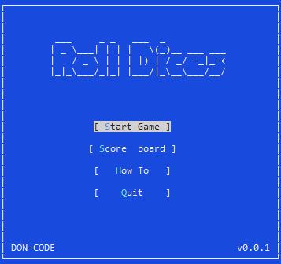
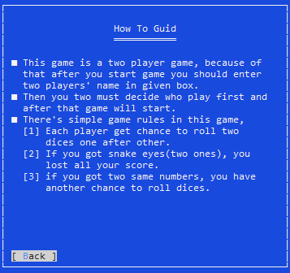
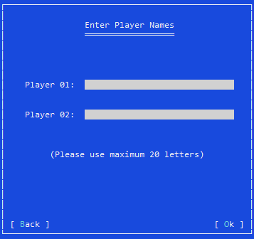
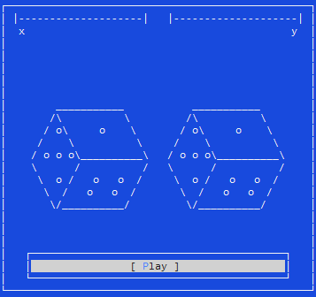

# Roll Dices Game (Terminal.Gui, C#)

Experience the thrill of the Roll Dices game in this simple two-player terminal-based game written in C# using the Terminal.Gui package. Challenge your friends and take turns rolling the dice to reach the highest score.

## Features

- Two-player dice rolling game.
- Written in C# using Terminal.Gui.
- Roll virtual dice and aim for the highest score.

## Game Files

Explore the game files in the 'RollDices' folder to understand the project's structure.

## Activity Diagram

Check out the game's activity diagram in the 'Activity diagram (Roll Dices game)' folder to get insights into the game's logic.


## How to add Terminal.Gui 

To add Terminal.Gui to the project, follow these steps:

1. Open your terminal or command prompt.

2. Navigate to the project directory.

3. Run the following command:

   ```shell
   dotnet add package Terminal.Gui --version 1.14.0

## How to Create an Executable (.exe) File

To create an executable (.exe) file for this project, follow these steps:

1. Open your terminal or command prompt.

2. Navigate to the project directory.

3. Run the following command:

   ```shell
   dotnet publish -c Release -r win-x64

## How to Play

1. Clone the repository to your local machine.
2. Open the project in your preferred C# IDE (e.g., Visual Studio).
3. Run the game and start rolling the dice!

Enjoy the excitement of the Roll Dices game on your Windows machine!

**Note:** This game works only on Windows.

## Application GUI




